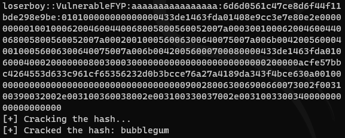

Made by botak

Disclaimer: PLEASE use hashcat to do this. Its alot faster. 

I needed to create a python-only tool for cracking NetNTLMv2 hashes as part of my fyp project. Nothing here is illegal of course.

Please understand the struggles of the average Singapore Polytechnic DISM student.

Thanks.

```
pip install pycryptodome
python netntlmv2_crack.py <wordlist> <hash>

for example if your brain is alittle slower.

python netntlmv2_crack.py /usr/share/wordlists/rockyou.txt loserboy::VulnerableFYP:aaaaaaaaaaaaaaaa:6d6d0561c47ce8d6f44f11bde298e9be:010100000000000000433de1463fda01408e9cc3e7e80e2e000000000100100062004600440068005800560052007a000300100062004600440068005800560052007a000200100056006300640075007a006b00420056000400100056006300640075007a006b00420056000700080000433de1463fda0106000400020000000800300030000000000000000000000000200000acfe57bbc4264553d633c961cf65356232d0b3bcce76a27a4189da343f4bce630a001000000000000000000000000000000000000900280063006900660073002f003100390032002e003100360038002e003100330037002e003100330034000000000000000000
```



Output of the NetNTLMv2 hash can be found from responder / smbserver or literally any other resource. Please modify as needed.

credits to https://davenport.sourceforge.net/ntlm.html#theNtlmResponse